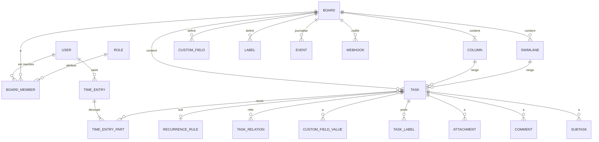

# Couloir — Spécification fonctionnelle pour Claude Code

## 0. Instructions pour Claude Code
- Lis l'intégralité de ce document avant d'écrire du code.
- Commence par proposer un plan de mise en œuvre par phases (MVP → V1 → V2) et la stack retenue, puis attends validation.
- Implémente le MVP d'abord, de bout en bout, avec des tests couvrant les critères d'acceptation.
- En cas d'ambiguïté, applique l'hypothèse la plus simple et note-la dans un fichier DECISIONS.md.
- Il s'agit d'un **outil interne** : aucune page publique, aucune inscription, aucun plan payant. Ne crée ni landing page, ni onboarding, ni facturation, même si une fonctionnalité de l'original y était liée.

## 1. Contexte et objectif
- Application de référence : KanbanFlow (CodeKick AB, Göteborg, Suède, depuis 2011) — tableau Kanban en ligne avec gestion du temps intégrée (Pomodoro, chronomètre) et rapports de flux (cumulative flow, cycle time, Monte Carlo…).
- Objectif : construire une application originale offrant ces fonctionnalités, en corrigeant ses défauts connus.
- Usage : **interne** — outil réservé à une équipe, sans inscription ni onboarding, authentification identifiant/mot de passe, comptes créés par un administrateur. Une seule instance = une seule organisation.
- Nouveau nom de code : **Couloir**. Ne reprendre ni marque, ni logo, ni textes, ni charte de l'original.
- Proposition de valeur différenciante :
  - **Toutes les fonctionnalités disponibles pour tous** (l'original réserve swimlanes, pièces jointes, recherche, rapports et API à son offre payante — l'irritant n° 1 des avis).
  - **Interface moderne, rapide et mobile-first** (PWA installable, utilisable hors-ligne), là où l'original est jugé daté et sans application mobile native.
  - **Rapports configurables et planifiables**, archivage explicite, tâches récurrentes planifiées à la bonne date, Pomodoro non intrusif.
  - **Auto-hébergeable** (demande d'utilisateurs : pas d'on-premise chez l'original).

## 2. Utilisateurs, rôles et permissions

Deux niveaux : rôle **global** (instance) et rôle **par board**.

| Rôle | Description | Peut faire | Ne peut pas faire |
|---|---|---|---|
| Administrateur (global) | Gère l'instance | Créer/désactiver/réactiver des comptes, réinitialiser un mot de passe, attribuer le rôle admin, voir tous les boards, gérer les rôles personnalisés, gérer les jetons API de l'instance, lancer un export complet | Voir le mot de passe d'un utilisateur |
| Utilisateur (global) | Membre de l'équipe | Se connecter, changer son mot de passe, modifier son profil (nom, avatar, fuseau, langue, thème), créer des boards (il en devient propriétaire) | Créer des comptes, accéder aux boards dont il n'est pas membre |
| Propriétaire de board | Créateur ou désigné | Tout sur le board : réglages, colonnes, swimlanes, membres, rôles, suppression/copie du board, jetons API et webhooks du board | — |
| Éditeur de board | Membre standard | Créer, modifier, déplacer, archiver, supprimer des tâches ; commenter ; saisir du temps ; voir les rapports | Modifier la structure du board (colonnes, swimlanes, champs, membres) |
| Lecteur de board | Lecture seule [Officiel] | Voir le board, les tâches, commentaires et rapports ; exporter | Toute modification |
| Rôle personnalisé [Officiel] | Défini par l'admin ou le propriétaire | Combinaison de permissions unitaires (voir 4.10) | Ce qui n'est pas coché |

## 3. Périmètre et priorisation

| Module | Fonctionnalité | Priorité | Origine |
|---|---|---|---|
| Comptes | Connexion identifiant/mot de passe, sessions | MVP | [Officiel] adapté usage interne |
| Comptes | Création de comptes par l'admin, premier admin au lancement | MVP | usage interne |
| Comptes | Changement de mot de passe, réinitialisation par admin | MVP | usage interne |
| Boards | Boards illimités, colonnes personnalisables, réordonnables, repliables | MVP | [Officiel] |
| Boards | Board par défaut To-do / Do today / In progress / Done | MVP | [Officiel] |
| Boards | Limites WIP par colonne | MVP | [Officiel] |
| Boards | WIP exprimé en nombre de tâches **ou** en pomodoros estimés | V1 | [Demande] |
| Boards | Swimlanes | MVP | [Officiel] (payant dans l'original) |
| Boards | Colonne Done groupée par date de complétion, repliable | MVP | [Officiel] |
| Boards | Copie de board, modèles de board | V1 | [Officiel] |
| Boards | Couleurs nommées (légende) et couleurs personnalisées | MVP / V1 | [Officiel] |
| Boards | Watch columns (suivre une colonne) | V1 | [Officiel] |
| Boards | Collaboration temps réel | MVP | [Officiel] |
| Boards | Mode « mur » (affichage TV/tablette plein écran) | V1 | [Demande] (HN) |
| Tâches | Création rapide, édition, drag & drop fluide | MVP | [Officiel] + [Correctif] |
| Tâches | Sous-tâches cochables, assignables, datées | MVP | [Officiel] |
| Tâches | Responsable + collaborateurs | MVP | [Officiel] |
| Tâches | Échéance avec colonne cible | MVP | [Officiel] / [Déduit] |
| Tâches | Labels (dont épinglés), ajout rapide | MVP | [Officiel] + [Correctif] |
| Tâches | Estimations (temps, points) | MVP | [Officiel] |
| Tâches | Numérotation des tâches (préfixe + n°) | V1 | [Officiel] |
| Tâches | Champs personnalisés (texte, nombre, liste) | V1 | [Officiel] |
| Tâches | Pièces jointes (fichiers locaux) | MVP | [Officiel] (payant dans l'original) |
| Tâches | Pièces jointes cloud (Drive, OneDrive, Dropbox, Box) | V2 | [Officiel] |
| Tâches | Commentaires, mentions | MVP | [Officiel] / mentions [Déduit] |
| Tâches | Relations (lié à, dépend de, requis par), inter-boards | V1 | [Officiel] |
| Tâches | Tâches récurrentes, prochaine occurrence à la date prévue | MVP | [Officiel] + [Correctif] |
| Tâches | Modèles de tâches | V1 | [Demande] |
| Tâches | Archivage explicite et restauration | MVP | [Correctif] |
| Tâches | Date de complétion éditable (y compris passée) | MVP | [Correctif] |
| Tâches | Mise à jour en masse | V1 | [Officiel] |
| Tâches | Tri automatique d'une colonne | V1 | [Officiel] |
| Tâches | Déplacement vers un autre board | V1 | [Officiel] |
| Recherche & filtres | Filtre (utilisateur, label, couleur, échéance, champs perso) | MVP | [Officiel] |
| Recherche & filtres | Recherche plein texte (nom, description, commentaires, sous-tâches) | MVP | [Officiel] (payant dans l'original) |
| Temps | Pomodoro, pauses, interruptions | MVP | [Officiel] |
| Temps | Chronomètre multi-tâches | MVP | [Officiel] |
| Temps | Saisie manuelle | MVP | [Officiel] |
| Temps | Pomodoro activable/désactivable, non intrusif | MVP | [Demande] |
| Rapports | Temps passé (soi/équipe, filtres, regroupements) | MVP | [Officiel] |
| Rapports | Statistiques Pomodoro | V1 | [Officiel] |
| Rapports | Cumulative flow, cycle/lead time, burndown, throughput | V1 | [Officiel] |
| Rapports | Performance des échéances, estimations, nb de tâches | V1 | [Officiel] |
| Rapports | Prévision Monte Carlo | V2 | [Officiel] |
| Rapports | Tableau de bord | V1 | [Officiel] |
| Rapports | Rapports enregistrés et planifiés (par période) | V1 | [Demande] |
| Rapports | Export CSV/Excel, PDF, vue impression | MVP (CSV, impression) / V1 (Excel, PDF) | [Officiel] + [Demande] PDF |
| Planification | Vue calendrier | V1 | [Officiel] |
| Planification | Timeline / Gantt (drag & resize, conflits) | V2 | [Officiel] |
| Planification | Flux iCal | V1 | [Officiel] |
| Historique | Historique de révisions (board, tâche) | V1 | [Officiel] |
| Intégrations | Import CSV/Excel | V1 | [Officiel] |
| Intégrations | API REST + webhooks signés | V1 | [Officiel] |
| Intégrations | Création de tâche par email entrant | V2 | [Officiel] / [Déduit] |
| Intégrations | Zapier / Notion | V2 | [Officiel] / [Demande] |
| Notifications | In-app (assignation, mention, échéance, colonne suivie) | MVP | [Déduit] |
| Notifications | Email (si SMTP configuré) | V2 | [Déduit] |
| Transverse | PWA mobile, hors-ligne | V1 | [Demande] / [Correctif] |
| Transverse | Mode sombre | MVP | [Officiel] |
| Transverse | i18n (FR, EN au minimum) | MVP | [Demande] |
| Transverse | Auto-hébergement (Docker), sauvegardes | MVP | [Demande] / [Officiel] |

## 4. Modules fonctionnels

### 4.1 Comptes et authentification (usage interne)
- **But** : accès réservé à l'équipe, sans aucun parcours public.
- **User stories**
  - En tant qu'administrateur, je veux créer un compte (identifiant, nom complet, mot de passe initial, rôle global) afin que mon collègue puisse se connecter.
  - En tant qu'utilisateur, je veux me connecter avec mon identifiant et mon mot de passe afin d'accéder à mes boards.
  - En tant qu'utilisateur, je veux changer mon mot de passe afin de remplacer le mot de passe initial.
  - En tant qu'administrateur, je veux réinitialiser le mot de passe d'un utilisateur afin de débloquer quelqu'un qui l'a oublié.
  - En tant qu'administrateur, je veux désactiver un compte afin de couper l'accès d'une personne qui quitte l'équipe sans perdre son historique.
- **Règles de gestion**
  - Premier lancement : si aucun compte n'existe, un administrateur est créé depuis des variables d'environnement (`ADMIN_USERNAME`, `ADMIN_PASSWORD`) ou une commande de seed. Sans ces variables, l'application refuse de démarrer avec un message explicite.
  - Identifiant unique, insensible à la casse, 3-50 caractères `[a-z0-9._-]`. L'email est un champ de profil **facultatif**, jamais utilisé pour l'authentification.
  - Mots de passe hachés (Argon2id ou bcrypt), longueur minimale 10 caractères. Jamais stockés ni journalisés en clair.
  - Sessions par cookie `HttpOnly`, `Secure`, `SameSite=Lax`, expiration glissante (ex. 14 jours) ; déconnexion invalide la session côté serveur. Protection CSRF.
  - Limitation des tentatives de connexion (ex. 5 échecs / 15 min par identifiant + IP), message d'erreur générique.
  - Après réinitialisation par l'admin : mot de passe temporaire, changement obligatoire à la connexion suivante ; toutes les sessions existantes de l'utilisateur sont invalidées.
  - Un changement de mot de passe exige le mot de passe actuel et invalide les autres sessions.
  - Compte désactivé : connexion refusée, sessions révoquées ; ses tâches, commentaires et temps restent visibles avec son nom (mention « désactivé »). Pas de suppression physique depuis l'interface en MVP.
  - Il doit toujours rester au moins un administrateur actif.
- **Critères d'acceptation**
  - Given une base vide et les variables admin définies, When l'app démarre, Then un compte admin existe et peut se connecter.
  - Given un mauvais mot de passe, When je me connecte, Then le message est « Identifiant ou mot de passe incorrect » sans préciser lequel.
  - Given 5 échecs consécutifs, When je retente, Then la connexion est bloquée temporairement.
  - Given l'admin réinitialise mon mot de passe, When je me connecte avec le temporaire, Then je suis forcé à en choisir un nouveau avant tout autre écran.
  - Given le dernier admin, When on tente de lui retirer le rôle admin ou de le désactiver, Then l'action est refusée.
  - Il n'existe aucune route d'inscription, de mot de passe oublié par email ni de connexion sociale.
- **Améliorations vs original** : 2FA, SSO et inscription retirés (voir § 12) ; comptes gérés centralement.

### 4.2 Boards, colonnes et swimlanes
- **But** : modéliser un flux de travail visuel.
- **User stories**
  - En tant qu'utilisateur, je veux créer un board avec des colonnes par défaut afin de démarrer immédiatement.
  - En tant que propriétaire, je veux ajouter, renommer, réordonner, décrire et supprimer des colonnes afin d'adapter le board à mon processus.
  - En tant que propriétaire, je veux fixer une limite WIP par colonne afin de limiter le travail en cours.
  - En tant que propriétaire, je veux ajouter des swimlanes (par équipe, produit, priorité) afin de séparer les flux horizontalement.
  - En tant que membre, je veux replier une colonne afin de gagner de la place.
  - En tant que propriétaire, je veux ajouter des membres au board et leur donner un rôle.
  - En tant que propriétaire, je veux copier un board (structure seule ou structure + tâches) afin de réutiliser une configuration.
- **Règles de gestion**
  - Board créé avec les colonnes **To-do / Do today / In progress / Done** (libellés traduits), modifiables.
  - Un board a au moins une colonne. Supprimer une colonne non vide exige de choisir une colonne de destination pour ses tâches.
  - Une colonne peut être marquée **colonne de complétion** (une seule par board, par défaut la dernière) : y entrer fixe `completedAt` ; en sortir l'efface.
  - La colonne de complétion affiche les tâches **groupées par date de complétion** (Aujourd'hui, Hier, puis par date), groupes repliables, les plus anciens repliés par défaut.
  - Limite WIP : entier ≥ 1 ou vide (aucune limite). Dépassement **autorisé mais signalé** (en-tête de colonne en rouge, compteur `n / limite`). V1 : option « WIP en pomodoros » qui somme les pomodoros estimés des tâches.
  - Swimlanes optionnelles ; si le board en a, chaque tâche appartient à exactement une swimlane. Supprimer une swimlane non vide exige une destination.
  - Couleurs de tâche : palette fixe (jaune, blanc, rouge, vert, bleu, violet, orange, cyan, marron, magenta) ; le propriétaire peut nommer chaque couleur (légende affichée) et, en V1, ajouter des couleurs personnalisées (hex).
  - État replié des colonnes mémorisé par utilisateur.
  - Collaboration temps réel : toute modification apparaît chez les autres membres connectés en moins de 2 s sans rechargement ; conflits d'édition simultanée d'un même champ : dernier enregistrement gagnant, avec indicateur « modifié par X à l'instant ».
  - Watch columns (V1) : un membre peut suivre une colonne et être notifié des tâches qui y entrent.
  - Mode mur (V1) : affichage plein écran lecture seule, rafraîchi en temps réel, sans chrome d'interface.
  - Suppression de board : réservée au propriétaire, confirmation par saisie du nom ; corbeille de 30 jours restaurable par l'admin.
- **Critères d'acceptation**
  - Given un nouveau board, Then il contient 4 colonnes par défaut et 0 swimlane.
  - Given une colonne limitée à 3 avec 3 tâches, When j'en dépose une 4e, Then le dépôt réussit et l'en-tête signale le dépassement.
  - Given une tâche déplacée dans la colonne de complétion, Then `completedAt` = maintenant et elle apparaît sous « Aujourd'hui ».
  - Given deux navigateurs sur le même board, When l'un déplace une tâche, Then l'autre la voit déplacée en moins de 2 s.
- **Améliorations vs original** : swimlanes, couleurs perso et copie accessibles à tous ; administration du board en peu de clics (réglages dans un seul panneau) [Correctif] ; mode mur [Demande].

### 4.3 Tâches
- **But** : l'unité de travail du board.
- **User stories**
  - En tant que membre, je veux créer une tâche en tapant son nom en haut ou en bas d'une colonne et en validant par Entrée afin d'en saisir plusieurs à la suite.
  - En tant que membre, je veux déplacer une tâche par glisser-déposer entre colonnes et swimlanes, ou au clavier, afin de faire avancer le travail.
  - En tant que membre, je veux ouvrir le détail d'une tâche afin d'éditer description, responsable, collaborateurs, couleur, labels, échéance, estimations, sous-tâches, champs personnalisés, pièces jointes, commentaires et relations.
  - En tant que membre, je veux archiver des tâches terminées afin d'alléger le board, et les retrouver plus tard.
  - En tant que membre, je veux corriger la date de complétion d'une tâche afin de refléter un travail fini un autre jour.
  - En tant que membre, je veux créer une tâche à partir d'un modèle afin de ne pas ressaisir une checklist récurrente.
- **Règles de gestion**
  - Nom obligatoire (1-255 caractères). Description en Markdown (ou texte riche) avec liens cliquables.
  - Position ordonnée dans sa colonne (+ swimlane) ; insertion en haut ou en bas au choix.
  - Responsable : 0 ou 1 membre du board. Collaborateurs : 0..n membres.
  - Labels : texte libre réutilisable au niveau du board, autocomplétion, création à la volée ; un label peut être **épinglé** (affiché sur la carte) ou non.
  - Échéance : date (+ heure facultative, fuseau de l'utilisateur, stockée en UTC) et **colonne cible** (par défaut la colonne de complétion). L'échéance est « tenue » si la tâche atteint la colonne cible avant l'échéance, « en retard » sinon. Affichage : badge orange J-1, rouge en retard.
  - Estimations : temps (h/min) et/ou points (décimal ≥ 0) ; le temps passé cumulé est calculé à partir des entrées de temps.
  - Sous-tâches : nom, cochée/non, responsable et échéance facultatifs, réordonnables ; progression `x/y` affichée sur la carte ; cochables directement depuis la carte.
  - Numérotation (V1) : option par board, préfixe libre (ex. `OPS-`) + entier auto-incrémenté non réutilisé.
  - Champs personnalisés (V1) : définis au niveau du board, types texte, nombre (avec préfixe/suffixe d'unité, ex. `€`) et liste déroulante ; filtrables et utilisables dans les rapports ; affichage sur la carte optionnel par champ.
  - Pièces jointes : upload local multiple, glisser-déposer, aperçu image, taille max configurable (défaut 25 Mo/fichier) ; stockage disque ou compatible S3. Pièces jointes cloud par lien en V2.
  - Commentaires : texte Markdown, auteur, horodatage, édition et suppression par l'auteur (mention « modifié ») ; mentions `@identifiant` qui notifient.
  - Relations (V1) : *lié à* (symétrique), *dépend de* / *requis par* (inverses l'un de l'autre) ; possible entre boards de l'instance si l'utilisateur a accès aux deux ; une tâche dont une dépendance n'est pas terminée affiche un indicateur « bloquée ».
  - Archivage : action sur une tâche, sur une sélection, ou « archiver les tâches terminées avant le JJ/MM » sur la colonne de complétion. Les tâches archivées disparaissent du board, restent cherchables et comptées dans les rapports ; restauration dans leur colonne d'origine (ou la première si elle n'existe plus).
  - Date de complétion éditable manuellement (date passée autorisée, pas de date future).
  - Suppression : définitive après confirmation, réservée aux rôles ayant la permission ; journalisée dans l'historique.
  - Mise à jour en masse (V1) : sélection multiple (Maj/Ctrl+clic ou cases) → déplacer, changer responsable, couleur, labels, échéance, archiver, supprimer.
  - Tri automatique (V1) : option par colonne, critère (échéance, priorité/couleur, nom, date de création) ; le tri automatique désactive le réordonnancement manuel dans cette colonne.
  - Déplacement vers un autre board (V1) : choix du board, colonne et swimlane (défaut : premières) ; les champs incompatibles (labels, champs perso inexistants) sont signalés avant validation.
  - Modèles de tâches (V1) : enregistrer une tâche comme modèle (nom, description, sous-tâches, labels, couleur, estimations, champs perso) au niveau du board.
- **Critères d'acceptation**
  - Given une colonne, When je tape un nom et Entrée, Then la tâche est créée et le champ reste prêt pour la suivante.
  - Given une tâche avec échéance et colonne cible Done, When elle atteint Done avant l'échéance, Then l'échéance est marquée tenue.
  - Given 3 sous-tâches dont 1 cochée, Then la carte affiche `1/3`.
  - Given une tâche archivée, When je cherche son nom, Then elle apparaît avec l'étiquette « Archivée » et un bouton Restaurer.
  - Given une tâche terminée, When je mets sa date de complétion à hier, Then elle passe dans le groupe « Hier » et les rapports en tiennent compte.
  - Given une tâche A qui dépend de B non terminée, Then A affiche l'indicateur « bloquée ».
  - Le glisser-déposer fonctionne à la souris, au tactile (avec défilement automatique aux bords) et au clavier (espace pour saisir, flèches, espace pour déposer).
- **Améliorations vs original** : création et ajout de labels plus rapides [Correctif] ; drag & drop fluide [Correctif] ; archivage explicite [Correctif] ; date de complétion passée [Correctif] ; modèles de tâches [Demande] ; PJ et recherche pour tous.

### 4.4 Tâches récurrentes
- **But** : automatiser les tâches répétitives.
- **User stories**
  - En tant que membre, je veux définir une récurrence sur une tâche afin qu'une nouvelle occurrence soit créée automatiquement.
- **Règles de gestion**
  - Fréquences : quotidienne, jours ouvrés, hebdomadaire (jours choisis), mensuelle (jour du mois ou « 2e mardi »), annuelle, tous les N jours/semaines/mois.
  - Mode de déclenchement : **à la complétion** (la prochaine occurrence est créée quand la tâche est terminée) — l'occurrence est créée dans la colonne de départ choisie (par défaut la première) **avec une date de début** calculée selon la règle ; elle reste **masquée (ou affichée dans une zone « À venir » repliée) jusqu'à cette date**.
  - Mode alternatif : **à date fixe** (créée à la date prévue même si la précédente n'est pas finie).
  - Une occurrence copie nom, description, sous-tâches (décochées), labels, couleur, responsable, estimations, champs perso ; l'échéance est décalée selon la règle.
  - Fin de récurrence : jamais, après N occurrences, ou à une date.
  - Modifier la règle s'applique aux occurrences futures uniquement.
- **Critères d'acceptation**
  - Given une tâche hebdomadaire due lundi, When je la termine mercredi, Then la prochaine occurrence est due lundi suivant et n'apparaît pas dans « To-do » avant sa date de début.
  - Given une récurrence « 3 occurrences », Then aucune 4e n'est créée.
- **Améliorations vs original** : [Correctif] l'original fait réapparaître la tâche immédiatement après complétion.

### 4.5 Recherche et filtres
- **But** : retrouver et focaliser.
- **Règles de gestion**
  - Filtre de board (barre persistante) : responsable (dont « moi », « non assignée »), label, couleur, échéance (en retard, aujourd'hui, cette semaine, sans), champs personnalisés, texte. Les filtres se combinent (ET entre critères, OU au sein d'un critère). Indicateur visible quand un filtre est actif ; filtre mémorisé par utilisateur et par board.
  - Recherche globale (raccourci `/` ou `Ctrl+K`) : plein texte sur nom, description, commentaires, sous-tâches, labels, numéro de tâche, sur tous les boards accessibles, tâches archivées comprises (option). Résultats < 500 ms sur 50 000 tâches.
- **Critères d'acceptation**
  - Given le filtre « responsable = moi » + label « urgent », Then seules les tâches satisfaisant les deux sont visibles, les autres sont masquées (pas supprimées).
  - Given un mot présent uniquement dans un commentaire, When je le cherche, Then la tâche est trouvée.
- **Améliorations vs original** : recherche accessible à tous [Demande].

### 4.6 Gestion du temps (Pomodoro, chronomètre, saisie manuelle)
- **But** : mesurer le temps passé et soutenir la concentration.
- **User stories**
  - En tant que membre, je veux lancer un Pomodoro sur une tâche afin de travailler 25 minutes concentré.
  - En tant que membre, je veux noter une interruption et son motif afin d'analyser ce qui casse ma concentration.
  - En tant que membre, je veux lancer un chronomètre et basculer d'une tâche à l'autre sans l'arrêter.
  - En tant que membre, je veux saisir du temps a posteriori.
  - En tant que membre, je veux pouvoir masquer complètement le Pomodoro si je ne l'utilise pas.
- **Règles de gestion**
  - Minuteur global (un seul actif par utilisateur), visible dans une barre compacte non bloquante ; persiste en cas de rechargement ou de changement d'appareil (état côté serveur).
  - Pomodoro : durée de travail (défaut 25 min), pause courte (défaut 5 min), pause longue (défaut 15 min) toutes les 4 sessions — tout est paramétrable par utilisateur. Fin de session : son + notification navigateur (désactivables). Une session interrompue est enregistrée « échouée » avec un motif (liste paramétrable : interne, externe, réunion, autre + texte).
  - Pomodoro activable/désactivable par utilisateur ; désactivé = aucun élément Pomodoro dans l'interface.
  - Chronomètre : une session = suite de « parts », chacune liée à une tâche ; changer de tâche clôt la part courante et en ouvre une nouvelle.
  - Saisie manuelle : tâche, début, fin (ou durée), commentaire (≤ 200 caractères), labels de temps (ex. « Facturable »).
  - Une entrée de temps est modifiable/supprimable par son auteur ; l'admin et le propriétaire du board peuvent les voir toutes.
  - Le temps passé d'une tâche = somme de ses entrées ; affiché sur la carte face à l'estimation.
- **Critères d'acceptation**
  - Given un Pomodoro lancé, When je recharge la page, Then le compte à rebours continue au bon temps.
  - Given un chronomètre sur A pendant 10 min puis B pendant 5 min, Then A reçoit 10 min et B 5 min.
  - Given Pomodoro désactivé dans mes préférences, Then aucun bouton ni statistique Pomodoro n'apparaît pour moi.
- **Améliorations vs original** : Pomodoro non intrusif et désactivable [Demande] ; commentaire plus long que les 50 caractères de l'original [Déduit].

### 4.7 Rapports et analytique
- **But** : piloter le flux et le temps.
- **Règles de gestion**
  - Rapport **temps passé** (MVP) : période, utilisateurs, boards, labels de temps ; regroupement par utilisateur / tâche / board / label / jour / semaine ; totaux ; export CSV.
  - **Statistiques Pomodoro** (V1) : sessions réussies/échouées par jour, évolution, répartition des motifs d'interruption.
  - **Flux** (V1) : cumulative flow (tâches par colonne dans le temps), cycle time (entrée en « en cours » → complétion ; colonne de départ configurable) et lead time (création → complétion) en nuage de points + percentiles 50/85/95, burndown (points ou nombre de tâches vs date cible), throughput (tâches terminées par semaine).
  - **Échéances** (V1) : % tenues / en retard, par période et responsable.
  - **Estimations** (V1) : estimé vs passé par tâche/utilisateur.
  - **Nombre de tâches** (V1) : par colonne, label, responsable, champ personnalisé.
  - **Monte Carlo** (V2) : à partir du throughput historique (période choisie), prévoir « quand N tâches seront terminées » et « combien de tâches d'ici une date », avec niveaux de confiance 50/85/95 %.
  - **Tableau de bord** (V1) : widgets choisis parmi les rapports ci-dessus, par board ou multi-boards.
  - **Rapports enregistrés et planifiés** (V1) : enregistrer un rapport avec ses filtres ; génération automatique par période (hebdo, mensuelle) disponible dans l'app (et envoyée par email si SMTP est configuré).
  - Tous les rapports respectent les filtres de board (y compris champs perso) et incluent les tâches archivées.
  - Exports : CSV (MVP), Excel et PDF (V1) ; vue impression du board (MVP).
  - Les rapports de flux reposent sur l'historique des mouvements (§ 4.9) ; ils doivent être calculables rétroactivement dès la création du board.
- **Critères d'acceptation**
  - Given 3 tâches terminées cette semaine, Then le throughput de la semaine vaut 3.
  - Given des entrées de temps pour 2 utilisateurs, When je regroupe par utilisateur, Then les totaux correspondent à la somme des entrées.
  - Given un rapport planifié hebdomadaire, Then une nouvelle instance est disponible chaque lundi pour la semaine écoulée.
- **Améliorations vs original** : rapports personnalisables et planifiés [Demande] ; export PDF [Demande].

### 4.8 Planification : calendrier, timeline/Gantt, iCal
- **Règles de gestion**
  - Calendrier (V1) : tâches affichées à leur échéance (mois/semaine) ; glisser une tâche change son échéance ; filtres du board applicables.
  - Flux iCal (V1) : URL secrète par utilisateur (ses tâches) ou par board, lecture seule, révocable/régénérable ; compatible Google Calendar et Outlook.
  - Timeline/Gantt (V2) : barres début → fin par tâche, déplacement et redimensionnement à la souris, flèches de dépendance (relations « dépend de »), signalement des conflits (tâche planifiée avant la fin de sa dépendance) ; vue multi-boards.
- **Critères d'acceptation**
  - Given une tâche glissée au 12 dans le calendrier, Then son échéance devient le 12.
  - Given A dépend de B et A commence avant la fin de B, Then le Gantt signale le conflit.

### 4.9 Historique de révisions
- **But** : traçabilité et base des rapports de flux.
- **Règles de gestion**
  - Chaque modification de tâche est journalisée : auteur, horodatage, propriété, ancienne et nouvelle valeur (création, déplacement colonne/swimlane, champs, sous-tâches, commentaires, PJ, archivage, suppression).
  - Onglet « Historique » dans la tâche ; journal du board filtrable (V1).
  - Le journal n'est pas modifiable par les utilisateurs.
- **Critères d'acceptation** : Given je change la couleur d'une tâche, Then l'historique montre « couleur : jaune → rouge, par moi, à HH:MM ».

### 4.10 Permissions et rôles personnalisés
- **Règles de gestion**
  - Permissions unitaires : voir le board, créer des tâches, modifier des tâches, déplacer des tâches, supprimer des tâches, commenter, saisir du temps, voir le temps des autres, voir les rapports, gérer la structure (colonnes/swimlanes/champs), gérer les membres, gérer l'API/webhooks.
  - Rôles prédéfinis (Propriétaire, Éditeur, Lecteur) non supprimables ; rôles personnalisés (V1) = ensemble de permissions, définis au niveau de l'instance par l'admin.
  - Toute vérification de permission est faite côté serveur.
- **Critères d'acceptation** : Given un lecteur, When il tente via l'API de déplacer une tâche, Then réponse 403.

### 4.11 Administration de l'instance
- **But** : gérer l'équipe et l'instance sans ligne de commande.
- **Règles de gestion**
  - Liste des comptes (actifs/désactivés), création, édition (nom, email facultatif, rôle global), réinitialisation de mot de passe, désactivation/réactivation.
  - Vue de tous les boards avec propriétaire ; transfert de propriété (utile quand un propriétaire est désactivé).
  - Corbeille des boards supprimés (30 jours).
  - Paramètres de l'instance : nom affiché, langue par défaut, fuseau par défaut, taille max des PJ, paramètres SMTP facultatifs.
  - Export complet de l'instance (JSON + fichiers) et restauration (V1).
- **Critères d'acceptation** : Given un propriétaire désactivé, When l'admin transfère son board à un autre membre, Then celui-ci obtient tous les droits de propriétaire.

### 4.12 Interface, mobile et accessibilité
- **Règles de gestion**
  - Interface sobre et moderne, dense mais lisible ; mode clair / sombre / système.
  - Raccourcis clavier (liste affichée via `?`) : nouvelle tâche, recherche, filtre, démarrer/arrêter le minuteur, naviguer entre colonnes.
  - PWA installable (V1) : vue mobile avec une colonne à la fois, balayage entre colonnes, mode paysage multi-colonnes, glisser-déposer tactile avec défilement auto, cocher sous-tâches, commenter ; consultation et modifications hors-ligne mises en file et synchronisées au retour du réseau (conflits : dernier gagnant + notification).
  - Langues : français et anglais au MVP ; textes externalisés pour ajout ultérieur.
- **Critères d'acceptation** : Given un mobile hors-ligne, When je déplace une tâche puis reviens en ligne, Then le déplacement est synchronisé et visible des autres membres.
- **Améliorations vs original** : UI modernisée [Demande], vraie expérience mobile [Correctif], multilingue [Demande].

## 5. Parcours utilisateur clés

**Premier lancement (pas d'onboarding)**
1. L'exploitant déploie l'application avec `ADMIN_USERNAME` / `ADMIN_PASSWORD`.
2. L'admin se connecte, change son mot de passe.
3. L'admin crée les comptes de l'équipe et communique hors application identifiant et mot de passe temporaire.
4. Chaque membre se connecte, choisit son mot de passe, arrive sur la liste (vide) de ses boards avec un bouton « Créer un board ».

**Flux principal (Kanban quotidien)**
1. Le membre crée un board (colonnes par défaut), ajoute des membres.
2. Il saisit plusieurs tâches à la suite dans To-do.
3. Le matin, il glisse les tâches du jour dans Do today, puis en In progress (alerte si WIP dépassé).
4. Il lance un Pomodoro sur la tâche en cours ; note une interruption si besoin.
5. Il coche les sous-tâches, commente, joint un fichier.
6. Il glisse la tâche dans Done ; elle apparaît sous « Aujourd'hui » ; la récurrence éventuelle prépare l'occurrence suivante.
7. En fin de semaine, il archive les tâches terminées anciennes.

**Collaboration**
1. Le propriétaire ajoute un collègue au board comme Éditeur.
2. Il lui assigne une tâche ; le collègue reçoit une notification in-app.
3. Le collègue mentionne `@propriétaire` dans un commentaire ; notification.
4. Les deux voient les mouvements en temps réel ; un manager en Lecteur affiche le board en mode mur sur un écran.

**Pilotage**
1. Le responsable ouvre le tableau de bord : cumulative flow, cycle time, throughput.
2. Il génère le rapport de temps de la semaine par utilisateur, l'exporte en CSV/Excel.
3. (V2) Il lance une prévision Monte Carlo pour le backlog restant.

**Gestion d'un départ**
1. L'admin désactive le compte du partant.
2. Il transfère la propriété de ses boards et réassigne ses tâches (mise à jour en masse).

## 6. Modèle de données

Champs principaux (✱ = obligatoire). Tous les horodatages en UTC.

- **User** : id✱, username✱ (unique), fullName✱, email?, passwordHash✱, globalRole✱ (`admin` | `user`), status✱ (`active` | `disabled`), mustChangePassword✱ (bool), locale, timezone, theme (`light`|`dark`|`system`), pomodoroEnabled (bool), pomodoroSettings (json), createdAt, lastLoginAt.
- **Session** : id✱, userId✱, createdAt, expiresAt, userAgent, ip.
- **Board** : id✱, name✱, description, ownerId✱, taskNumberPrefix?, taskNumberingEnabled, completionColumnId, deletedAt?, createdAt.
- **BoardMember** : boardId✱, userId✱, roleId✱.
- **Role** : id✱, name✱, builtIn (bool), permissions✱ (liste).
- **Column** : id✱, boardId✱, name✱, description, position✱, wipLimit?, wipUnit (`tasks`|`pomodoros`), autoSort?, isCompletion (bool).
- **Swimlane** : id✱, boardId✱, name✱, description, position✱.
- **BoardColor** : boardId✱, key✱ (couleur de palette ou hex), label?.
- **CustomField** : id✱, boardId✱, name✱, type✱ (`text`|`number`|`dropdown`), numberPrefix?, numberSuffix?, options[] (dropdown), showOnCard.
- **Task** : id✱, boardId✱, columnId✱, swimlaneId?, position✱, number?, name✱, description, color✱, responsibleUserId?, pointsEstimate?, secondsEstimate?, dueAt?, dueTargetColumnId?, startAt? (récurrence/Gantt), endAt? (Gantt), completedAt?, archivedAt?, recurrenceRuleId?, createdById✱, createdAt, updatedAt.
- **TaskCollaborator** : taskId✱, userId✱.
- **Label** : id✱, boardId✱, name✱ ; **TaskLabel** : taskId✱, labelId✱, pinned (bool).
- **SubTask** : id✱, taskId✱, name✱, done✱, position✱, assigneeId?, dueAt?.
- **CustomFieldValue** : taskId✱, fieldId✱, textValue? | numberValue? | optionId?.
- **Attachment** : id✱, taskId✱, fileName✱, mimeType, size, storageKey✱ (ou url pour lien cloud V2), uploadedById, createdAt.
- **Comment** : id✱, taskId✱, authorId✱, text✱, createdAt, updatedAt?.
- **TaskRelation** : id✱, fromTaskId✱, toTaskId✱, type✱ (`relatesTo` | `dependsOn`) — « requis par » = inverse de `dependsOn`.
- **RecurrenceRule** : id✱, rule✱ (RRULE iCal), mode✱ (`onCompletion` | `fixedDate`), startColumnId, endType (`never`|`count`|`until`), endValue?, occurrencesCreated.
- **TaskTemplate** : id✱, boardId✱, name✱, payload✱ (json).
- **TimeEntry** : id✱, userId✱, type✱ (`pomodoro` | `stopwatch` | `manual`), startAt✱, endAt?, comment?, timeLabels[], success? (pomodoro), targetWorkMinutes? (pomodoro), interruptionReason?.
- **TimeEntryPart** : id✱, timeEntryId✱, taskId✱, startAt✱, endAt?.
- **Event** (historique) : id✱, boardId✱, taskId?, actorId✱, type✱ (`taskCreated`, `taskChanged`, `taskMoved`, `taskArchived`, `taskDeleted`, `commentCreated`…), changes (json `{prop: {old, new}}`), at✱.
- **ColumnWatch** : userId✱, columnId✱.
- **Notification** : id✱, userId✱, type✱, taskId?, boardId?, payload, readAt?, createdAt.
- **SavedReport** : id✱, ownerId✱, type✱, filters✱ (json), schedule? (`weekly`|`monthly`).
- **ApiToken** : id✱, name✱, boardId? (null = instance, admin), tokenHash✱, permissions✱, createdById, lastUsedAt, revokedAt?.
- **Webhook** : id✱, boardId✱, callbackUrl✱, secret✱, events✱[], filter (columnId?, swimlaneId?, changedProperties?), active.
- **IcalFeed** : id✱, userId?, boardId?, tokenHash✱.

## 7. Plans, quotas et limites
Sans objet (usage interne) : aucune offre, aucun quota, toutes les fonctionnalités pour tous les comptes. Seules limites techniques : taille des pièces jointes (configurable) et limitation de débit de l'API (§ 8).

### Points à valider

| Élément | Source A | Source B | Décision retenue |
|---|---|---|---|
| Répartition gratuit/payant | Page tarifs lue en texte : tout inclus dans les deux plans | Même page vue dans un navigateur + FAQ/CGU : swimlanes, PJ, recherche, rapports, API, 2FA… payants | Sans effet en interne (tout inclus), mais confirme la liste des fonctionnalités « premium » à couvrir |
| Sémantique de la colonne cible d'échéance | API : `targetColumnId` requis | Aucune doc d'aide publique | [Déduit] échéance tenue quand la tâche atteint la colonne cible ; à confirmer à l'usage |
| Création de tâche par email | Annuaires tiers (sujet = nom, corps = description) | Page tarifs (« ajout par email ») | Gardé en V2, format sujet/corps [Déduit] |
| Comportement de la récurrence | Page fonctionnalités : copie créée à la complétion | Avis Capterra : réapparaît immédiatement | Copie créée à la complétion mais masquée jusqu'à sa date de début [Correctif] |
| Notifications de l'original | Aucune doc publique (seulement « watch columns ») | — | [Déduit] in-app pour assignation, mention, échéance, colonne suivie ; email en V2 si SMTP |
| 2FA | Officiel (payant) dans l'original | Mode interne : identifiant + mot de passe uniquement | Retiré du périmètre, réintégrable (§ 12) |

## 8. Intégrations, import/export, API
- **Import** (V1) : CSV/Excel → tâches ; assistant de correspondance des colonnes du fichier (nom, description, colonne, swimlane, responsable par identifiant, labels, échéance, estimations, champs perso) ; aperçu et rapport d'erreurs ligne par ligne avant validation.
- **Export** : CSV des tâches d'un board (MVP), Excel (V1), PDF du board ou d'un rapport (V1), vue impression (MVP), export complet de l'instance par l'admin (V1).
- **API REST** (V1), documentée en OpenAPI :
  - Authentification par jeton Bearer ; jeton **par board** (créé par le propriétaire) ou **d'instance** (créé par l'admin) ; permissions choisies à la création (lire / créer / modifier / supprimer tâches, commentaires, temps…) ; jeton affiché une seule fois, stocké haché, révocable.
  - Ressources : boards (structure : colonnes, swimlanes, couleurs, champs perso), tâches (CRUD, déplacement, sous-tâches, labels, échéances, collaborateurs, champs perso, relations, PJ en upload multipart), commentaires, utilisateurs (lecture : id, nom, identifiant), entrées de temps (lecture/création, filtre par intersection de période), événements (historique).
  - Pagination par curseur (limite ≤ 100), tri.
  - Limitation : 1000 requêtes/heure/jeton par défaut (configurable), en-têtes `X-RateLimit-Limit/Remaining/Reset`, réponse 429.
- **Webhooks** (V1) : événements `taskCreated`, `taskChanged`, `taskDeleted`, `commentCreated`, `commentChanged`, `commentDeleted` ; filtres par colonne, swimlane, propriétés modifiées ; payload avec ancienne/nouvelle valeur ; signature `X-Couloir-Signature: sha256=<HMAC hex>` avec secret ; vérification de l'URL à l'enregistrement (HEAD → 200) ; 5 nouvelles tentatives avec backoff ; journal des livraisons.
- **iCal** (V1) : voir § 4.8.
- **Création par email** (V2) : adresse dédiée par board (boîte IMAP ou webhook entrant de l'exploitant) ; sujet = nom, corps = description, pièces jointes conservées ; expéditeur doit correspondre à l'email d'un compte membre.
- **Connecteurs** (V2) : Zapier/Make (déclencheurs « tâche créée », « tâche déplacée » ; action « créer une tâche »), Notion [Demande], liens Google Drive/OneDrive/Dropbox/Box en pièces jointes.

## 9. Notifications
- Canal **in-app** (MVP) : centre de notifications (cloche + compteur), marquer comme lu / tout lire.
- Événements : on m'assigne une tâche ou une sous-tâche ; on me mentionne ; commentaire sur une tâche dont je suis responsable/collaborateur ; échéance à J-1 et dépassée sur mes tâches ; tâche entrant dans une colonne que je suis (V1) ; fin de Pomodoro/pause (notification navigateur).
- Préférences par utilisateur : activer/désactiver chaque type.
- **Email** (V2) : seulement si l'admin a configuré un SMTP ; résumé quotidien optionnel. Jamais requis pour l'authentification.
- Push PWA (V2).

## 10. Exigences non fonctionnelles
- **Performance** : board de 1 000 tâches visibles affiché en < 1,5 s ; drag & drop à 60 i/s ; propagation temps réel < 2 s.
- **Sécurité** : mots de passe hachés (Argon2id/bcrypt) ; sessions sécurisées (cf. § 4.1) ; CSRF ; contrôle d'accès côté serveur sur chaque requête ; limitation des tentatives de connexion ; en-têtes de sécurité (CSP, HSTS) ; TLS attendu en production (derrière reverse proxy) ; jetons API et iCal stockés hachés ; validation des uploads (type, taille) ; journal d'audit des actions admin.
- **Données personnelles (RGPD)** : données minimales (identifiant, nom, email facultatif) ; l'admin peut exporter les données d'un utilisateur et anonymiser un compte désactivé (nom remplacé par « Utilisateur supprimé »).
- **Accessibilité** : WCAG 2.1 AA ; glisser-déposer utilisable au clavier et annoncé aux lecteurs d'écran ; contrastes suffisants dans les deux thèmes ; information jamais portée par la seule couleur (les couleurs de tâche ont un libellé).
- **i18n** : FR et EN ; dates, nombres et fuseaux localisés.
- **Responsive / mobile** : PWA (cf. § 4.12), hors-ligne en V1.
- **Exploitation** : auto-hébergement via Docker / docker-compose (app + base + stockage fichiers) ; configuration par variables d'environnement ; migrations automatiques ; sauvegarde quotidienne documentée (base + fichiers) et procédure de restauration testée ; endpoint de santé.

## 11. Irritants de l'original à éviter

| Irritant constaté | Comportement attendu dans Couloir |
|---|---|
| Pas d'app mobile native, web mobile lent, synchronisation moyenne | PWA rapide, installable, hors-ligne avec synchronisation fiable |
| Interface datée (« Trello des années 90 »), refonte jugée plus difficile | Interface moderne, cohérente, raccourcis clavier, thème sombre |
| Création de tâche peu ergonomique, drag & drop peu fluide | Saisie en rafale (Entrée = tâche suivante), drag & drop fluide souris/tactile/clavier |
| Ajout de labels laborieux, administration du board en trop de clics | Autocomplétion + création de label à la volée ; réglages du board dans un seul panneau |
| Tâches récurrentes qui réapparaissent dès la complétion | Prochaine occurrence masquée jusqu'à sa date de début |
| Impossible d'archiver proprement les anciennes tâches | Archivage explicite, en masse, réversible, cherchable |
| Impossible de dater une complétion dans le passé | Date de complétion éditable |
| Rapports peu personnalisables, rapport de temps non généré par période | Rapports enregistrés, filtrables, planifiés ; dashboard configurable |
| Pomodoro intrusif | Pomodoro désactivable par utilisateur, barre de minuteur compacte |
| Recherche, PJ, swimlanes réservées au payant | Tout disponible pour tous |
| Pas d'export PDF | Export PDF board et rapports |
| Pas de multilingue | FR/EN, i18n prête |
| Intégrations accessibles surtout aux techniciens | Import assisté, iCal en un clic, connecteurs no-code en V2 |
| Pas d'auto-hébergement | Déploiement Docker documenté |

Points forts à **préserver** : simplicité, vitesse, Pomodoro intégré avec journal d'interruptions, limites WIP, affichage « mur » sur tablette, usage personnel par colonnes-jours.

## 12. Hors périmètre
- **Retirés — usage interne** (réversibles si l'outil s'ouvre un jour) :
  - Inscription publique, page de création de compte.
  - Onboarding : tutoriel/visite guidée, checklists, board de démonstration, emails de bienvenue.
  - Invitations par email, vérification d'email.
  - Connexion sociale / SSO (Google, Microsoft…).
  - Mot de passe oublié par email (remplacé par la réinitialisation par l'admin).
  - Double authentification (2FA) — l'auth est identifiant + mot de passe uniquement.
  - Plans Free/Premium, activation premium par board, tarifs, quotas, paywall, facturation, essais gratuits, rétrogradation avec perte de données.
  - Pages marketing (accueil, fonctionnalités, tarifs, blog), site public.
  - Gestion d'organisations multiples et suppression des organisations inactives (une instance = une organisation).
  - Site de secours public en lecture seule (remplacé par les sauvegardes et l'auto-hébergement).
  - Suppression de compte en libre-service (remplacée par désactivation/anonymisation par l'admin).
- **Autres** : applications natives iOS/Android (la PWA couvre le besoin) ; chat temps réel entre membres ; facturation client du temps passé (seul le label « Facturable » est fourni).

## 13. Stack recommandée
Stack laissée au choix de Claude Code ; recommandation :
- **TypeScript de bout en bout** : Next.js (App Router) ou SvelteKit pour l'UI + API, PostgreSQL (recherche plein texte native via `tsvector`, suffisante pour une équipe), Prisma ou Drizzle.
- **Temps réel** : WebSocket (Socket.IO ou serveur WS natif) avec diffusion par board ; PostgreSQL `LISTEN/NOTIFY` si plusieurs instances.
- **Drag & drop** : dnd-kit (accessible clavier et tactile).
- **Graphiques** : une bibliothèque standard (Recharts / ECharts).
- **Auth** : implémentation maison simple (Argon2 + sessions en base) ou Lucia/Auth.js en mode credentials uniquement — pas de fournisseur OAuth.
- **Fichiers** : disque local par défaut, compatible S3 en option.
- **Tâches planifiées** (récurrence, rapports, rappels) : file de jobs en base (pg-boss) plutôt qu'un service externe.
- **Déploiement** : image Docker unique + docker-compose (app, PostgreSQL), PWA via service worker.
Raison : une seule langue, une seule base, aucune dépendance SaaS — adapté à un outil interne auto-hébergé et à une petite équipe de maintenance.

## Annexe — Sources

**Officielles**
- https://kanbanflow.com/
- https://kanbanflow.com/features
- https://kanbanflow.com/premium
- https://kanbanflow.com/pricing (matrice lue dans le navigateur ; le rendu texte était trompeur)
- https://kanbanflow.com/press
- https://kanbanflow.com/time-tracking
- https://kanbanflow.com/pomodoro-technique
- https://kanbanflow.com/mobile-app
- https://kanbanflow.com/terms-of-service
- https://kanbanflow.com/privacy-policy
- https://kanbanflow.com/api-docs (pages board, tasks, dates, relations, custom fields, attachments, comments, users, time entries, events, webhooks, zapier)
- https://x.com/KanbanFlow/status/1755221962278723927 (mode sombre)
- https://www.aleanjourney.com/?p=25242 (board par défaut, tutoriel, 2012)

**Feedback & bugs**
- Hacker News : https://news.ycombinator.com/item?id=9049715 , https://news.ycombinator.com/item?id=15044763 , https://news.ycombinator.com/item?id=18891906 , https://news.ycombinator.com/item?id=22174551 , https://news.ycombinator.com/item?id=16491541
- Product Hunt : https://www.producthunt.com/products/kanbanflow

**Avis & comparatifs**
- Capterra (EN/FR) : https://www.capterra.com/p/161732/KanbanFlow/reviews , https://www.capterra.com/p/161732/KanbanFlow/reviews/Capterra___1173462/ , https://www.capterra.fr/reviews/161732/kanbanflow
- GetApp : https://www.getapp.com/project-management-planning-software/a/kanbanflow/reviews/ , https://www.getapp.com/project-management-planning-software/a/kanbanflow/
- G2 : https://www.g2.com/products/kanbanflow/reviews
- TrustRadius : https://www.trustradius.com/products/kanbanflow/reviews
- AlternativeTo : https://alternativeto.net/software/kanbanflow/about/
- SaaSHub : https://www.saashub.com/kanbanflow
- Annuaire (email → tâche, numérotation, tri auto) : https://projectmanagers.net/kanbanflow-pricing/
- Hacker News (recherche) : https://hn.algolia.com/api/v1/search?query=kanbanflow&tags=comment&hitsPerPage=50
- StackShare : consulté, URL non conservée dans les notes

**Non lues / sans résultat**
- Centre d'aide officiel : inexistant publiquement (https://kanbanflow.com/help → 404) — règles fines déduites de l'API.
- Reddit : bloqué (recherche et navigateur).
- Board de feedback public, GitHub : inexistants (produit propriétaire).
- Slant https://www.slant.co/options/6314/~kanbanflow-review (erreur SSL 526), Trustpilot (404), Chrome Web Store (consentement non accepté), app stores (pas d'app native).
- Écartée comme peu fiable : https://lifetips.alibaba.com/tech-efficiency/kanbanflow-is-a-fast-free-to-do-manager-with-a-built-i (contenu généré, contredit l'officiel).
